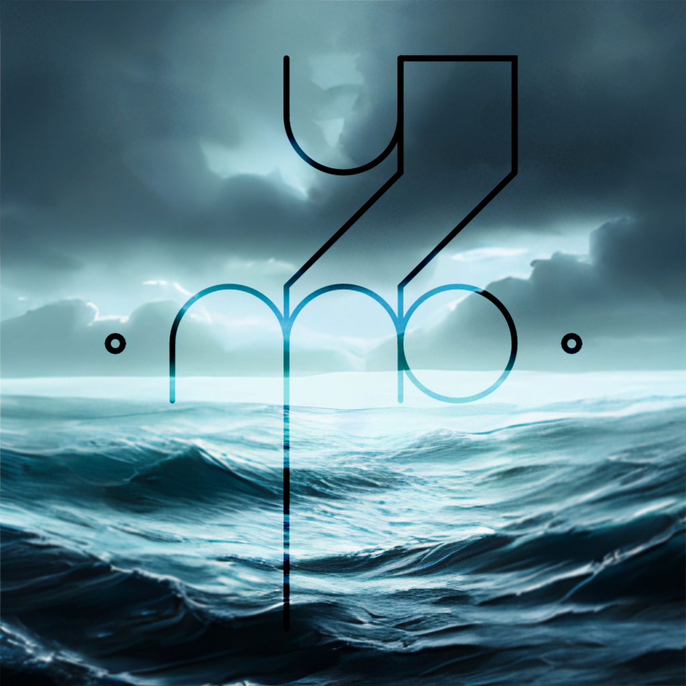
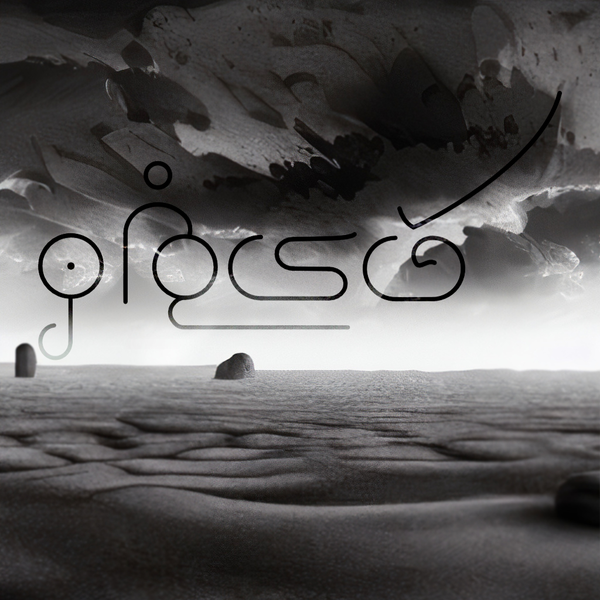

{:height="33%" width="33%"}.
* [Frísú](frisu)
A beautiful, sharp Uğh language of the sea.

 * [Khơlīvh \(Khơlīvh Ɯr\)](kholivh)
A harsh, dark ʔlat'ûl language with a pictoral writing system.

 * [Gylhevř](gylhevr)
A blunt, deep languag made for the sand dunes of Řogbu.

 * [Îär Tôr](iartor)
A perfect tongue of the Cÿrumâï, with a wild vertical writing system.
