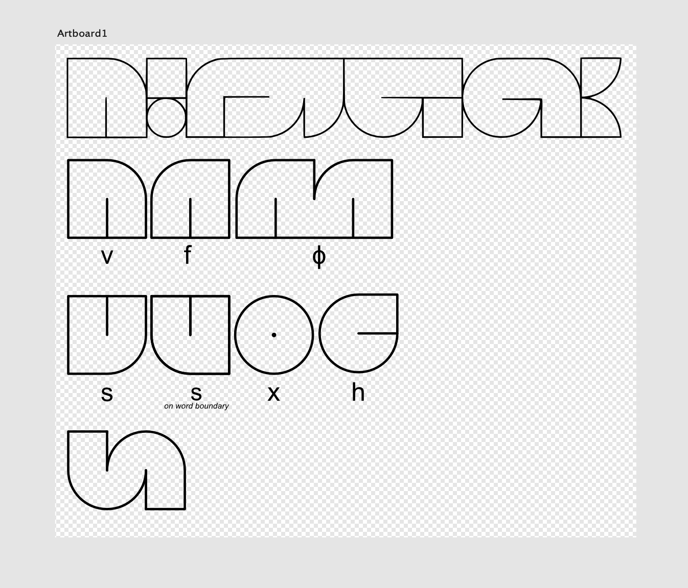

10/17/2022

I've been working a little on the writing system for the language U̇vįolıhu! It's an abugida.

 * Added the letters ɸ and x to make it a bit more alien looking
 * Added boundary-sensitive s
 
 The lang isn't done yet, but it can only have CV and VC syllables, with a max C cluster length of 2 (CCV is also allowed)
 It's aspiration sensitive now on all plosives! Suffixed -h indicates it.
 
 It's going to have a cool aesthic: like Turkish or Romanian or Polish or... 
  
 *[many hours later]*
  
 , with a blunt and cold feel. The kind of lang that would never use apostrophe.
 
 

For whatever reason, I'm not doing the usual, where I make each glyph in a different Artboard and name that Artboard the glyph's romanization, for ease of exporting. Might change that soon.

-ꙮ
